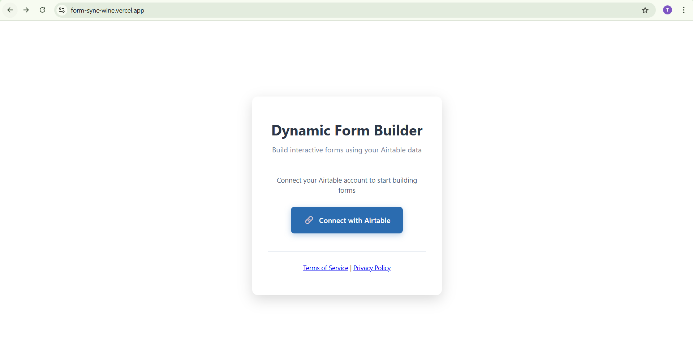
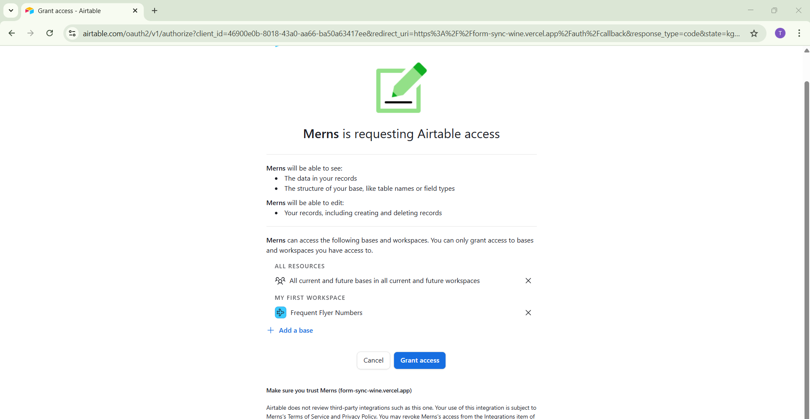
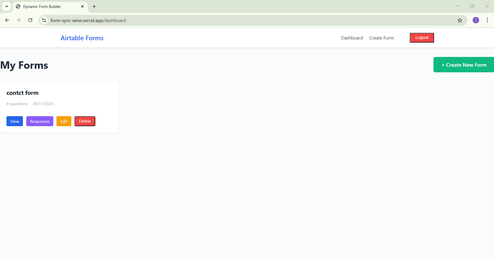
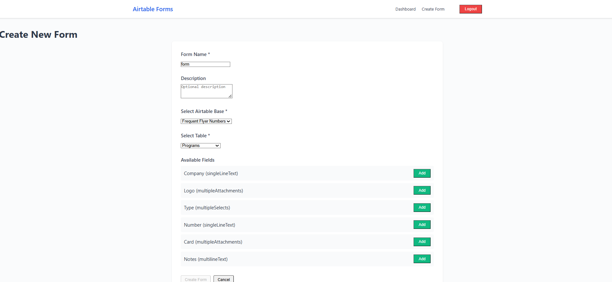

# Dynamic Form Builder

Full-stack MERN app for building forms from Airtable data.

## Setup Instructions

- Install dependencies:
  ```bash
  cd mern stack/backend && npm install
  cd mern stack/frontend && npm install
  ```
- Backend environment (`mern stack/backend/.env`):
  ```
  MONGODB_URI=mongodb://localhost:27017/formbuilder
  PORT=5000
  FRONTEND_URL=http://localhost:3000
  SESSION_SECRET=your-secret-key
  AIRTABLE_CLIENT_ID=your_client_id
  AIRTABLE_CLIENT_SECRET=your_client_secret
  AIRTABLE_REDIRECT_URI=http://localhost:3000/auth/callback
  WEBHOOK_BASE_URL=http://localhost:5000
  ```
- Frontend environment:
  - Development: relies on CRA proxy (`package.json:35`) to `http://localhost:5000`
  - Production: set `REACT_APP_API_BASE_URL` (see `mern stack/frontend/.env.production:1`)
  ```
  REACT_APP_API_BASE_URL=https://your-backend.example.com
  ```

## How To Run

- Start backend API:
  ```bash
  cd mern stack/backend
  npm run dev
  ```
- Start frontend:
  ```bash
  cd mern stack/frontend
  npm start
  ```

## Deployment

- See `mern stack/DEPLOYMENT.md` for detailed deployment instructions.
- Frontend: deploy `mern stack/frontend` to Vercel.
- Backend: deploy `mern stack/backend` to Render.

## API Overview

**Auth**
- `GET /api/auth/airtable` - Start OAuth
- `POST /api/auth/callback` - OAuth callback
- `GET /api/auth/me` - Get user
- `POST /api/auth/logout` - Logout

**Forms**
- `GET /api/forms` - List forms
- `POST /api/forms` - Create form
- `GET /api/forms/:id` - Get form
- `PUT /api/forms/:id` - Update form
- `DELETE /api/forms/:id` - Delete form
- `GET /api/forms/bases` - Get bases
- `GET /api/forms/bases/:baseId/tables` - Get tables
- `GET /api/forms/bases/:baseId/tables/:tableId/fields` - Get fields

**Responses**
- `POST /api/responses/submit` - Submit response
- `GET /api/responses/forms/:formId` - Get responses

**Webhooks**
- `POST /api/webhooks/airtable` - Airtable webhook

Code references: OAuth flow in `mern stack/backend/routes/auth.js:15-73` (authorize) and `mern stack/backend/routes/auth.js:75-186` (callback); webhook handler in `mern stack/backend/routes/webhooks.js:6-37`.

## Airtable OAuth Setup

- Create an Airtable OAuth integration in the Airtable developer hub.
- Configure redirect URI to match your frontend: `http://localhost:3000/auth/callback` (or your production domain).
- Set environment variables in backend: `AIRTABLE_CLIENT_ID`, `AIRTABLE_CLIENT_SECRET`, `AIRTABLE_REDIRECT_URI`.
- Required scopes used by the app: `data.records:read`, `data.records:write`, `schema.bases:read` (see `mern stack/backend/routes/auth.js:44-58`).
- Frontend initiates login via `GET /api/auth/airtable` and handles callback at `/auth/callback` using `AuthCallback` (`mern stack/frontend/src/pages/AuthCallback.js:19-38`).

## Data Model

- User (`mern stack/backend/models/User.js:3-45`): `airtableUserId`, `email`, `displayName`, `accessToken`, `refreshToken`, `tokenExpiry`, `airtableProfile`.
- Form (`mern stack/backend/models/Form.js:60-98`): `formTitle`, `formDescription`, `formOwner`, `connectedBaseId`, `connectedTableId`, `formFields`.
- Response (`mern stack/backend/models/Response.js:3-46`): `parentForm`, `airtableRecordId`, `fieldResponses`, `syncStatus`, `isDeletedInAirtable`.

## Conditional Logic

- Rules are defined per field with `operator` (`AND`/`OR`) and `conditions` of `fieldKey`, `comparisonType`, `expectedValue` (`mern stack/backend/utils/conditionalLogic.js:1-36`, `38-55`).
- Supported comparisons: `is_equal`, `not_equal`, `contains_text`.
- The frontend evaluates visibility while the user fills answers (`mern stack/frontend/src/pages/FormViewer.js:6-68`).

Example:
```json
{
  "operator": "AND",
  "conditions": [
    { "fieldKey": "role", "comparisonType": "is_equal", "expectedValue": "Engineer" }
  ]
}
```

## Webhook Configuration

- Endpoint: `POST /api/webhooks/airtable` (`mern stack/backend/routes/webhooks.js:6`).
- Purpose: sync changes from Airtable tables back into local responses (`changedRecordsById`, `destroyedRecordIds`).
- Register a webhook via Airtable API, pointing `notificationUrl` to your backend, for example:
```bash
curl -X POST \
  -H "Authorization: Bearer <AIRTABLE_ACCESS_TOKEN>" \
  -H "Content-Type: application/json" \
  "https://api.airtable.com/v0/bases/<BASE_ID>/webhooks" \
  -d '{
    "notificationUrl": "https://your-backend.example.com/api/webhooks/airtable",
    "specification": { "options": { "filters": ["data"] } }
  }'
```

## Screenshots / Demo






## Models

**User**: airtableUserId, email, displayName, accessToken, refreshToken, tokenExpiry

**Form**: formTitle, formOwner, connectedBaseId, connectedTableId, formFields

**Response**: parentForm, airtableRecordId, fieldResponses, syncStatus, isDeletedInAirtable

## Conditional Logic

Questions show/hide based on answers:

```javascript
{
  operator: "AND",
  conditions: [{
    fieldKey: "role",
    comparisonType: "is_equal",
    expectedValue: "Engineer"
  }]
}
```

Operators: `is_equal`, `not_equal`, `contains_text`
Logic: `AND`, `OR`

## Field Types

- singleLineText
- multilineText
- singleSelect
- multipleSelects
- multipleAttachments


